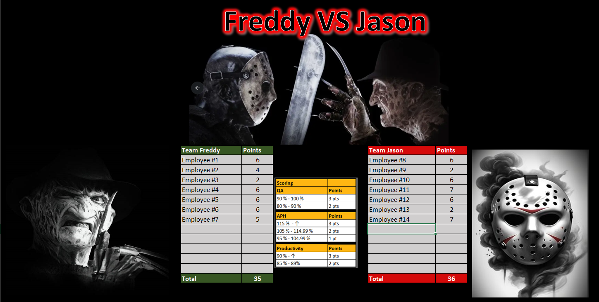
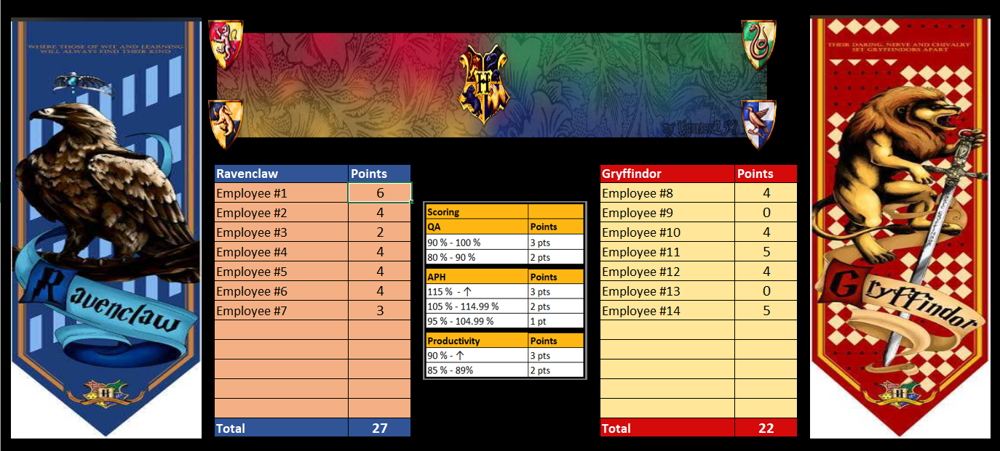
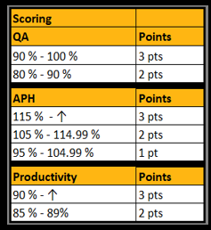
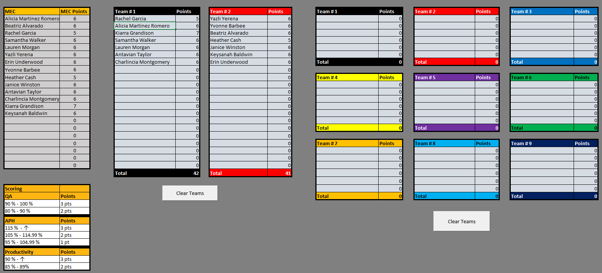
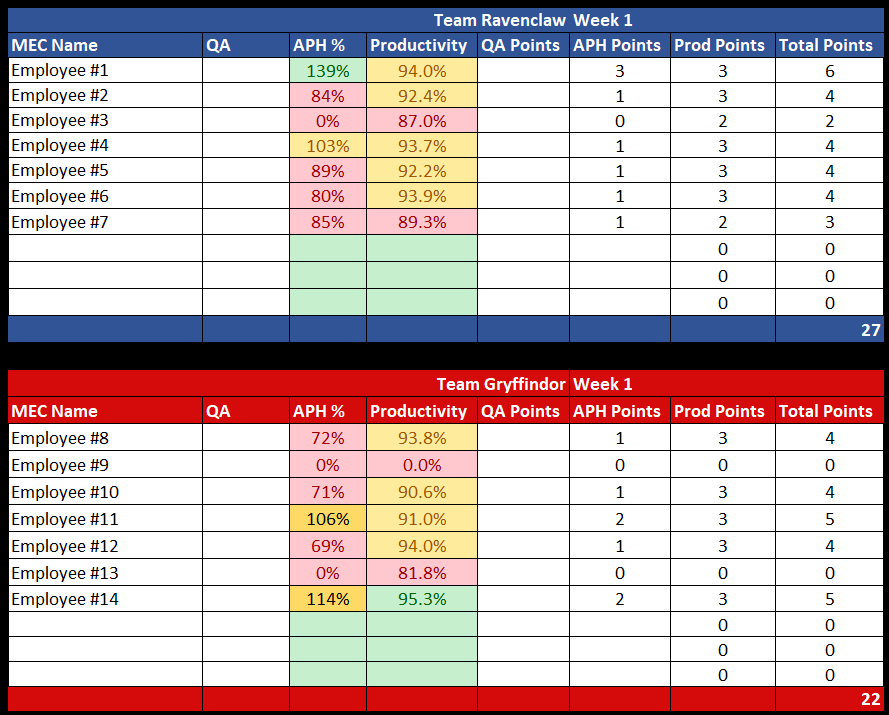

# Workforce Engagement Analytics Systems

## Project Overview

The Workforce Engagement Analytics Systems project was developed to improve employee engagement, operational visibility, and workforce accountability within a high-volume call center environment.

Traditional KPI reporting methods often lacked engagement and real-time visibility, making it difficult for employees and leadership teams to consistently monitor performance trends and maintain motivation across operational metrics.

To address these challenges, a series of Excel-based workforce analytics and KPI competition systems were designed and implemented using themed team competition frameworks. The systems combined operational performance metrics, quality assurance monitoring, productivity benchmarking, and automated scoring logic into centralized dashboards that transformed traditional reporting into interactive workforce engagement tools.

The scoring systems focused on the primary operational KPIs that directly contributed to organizational billables within a bill-to-pay program environment. Key metrics included:

- Quality Assurance (QA)
- Productivity / Schedule Adherence
- Appointments Per Hour (APH)

Employees were grouped into themed teams and evaluated through weighted scoring models that rewarded operational performance across multiple KPI categories tied directly to operational and financial performance outcomes.

Automated formulas, conditional formatting, dynamic team tracking, and dashboard visualizations allowed leadership to monitor performance trends while simultaneously increasing employee participation, accountability, and KPI awareness.

---

## KPI Scoring Framework

The workforce competition systems utilized weighted KPI scoring models designed around operational performance standards.

### Quality Assurance (QA)
- 90% – 100% = 3 points
- 80% – 89.99% = 2 points

### Appointments Per Hour (APH)
- 115%+ of goal = 3 points
- 105% – 114.99% = 2 points
- 95% – 104.99% = 1 point

### Productivity / Schedule Adherence
- 90%+ = 3 points
- 85% – 89% = 2 points

These KPI scoring thresholds standardized employee evaluations while reinforcing the operational behaviors most closely tied to program performance and billable outcomes.

---

## System Features

- Centralized KPI dashboards
- Team assignment and roster management
- Weekly performance tracking
- Automated point calculation systems
- QA and productivity integration
- Comparative team benchmarking
- Workforce engagement scoreboards
- Performance trend visualization
- Dynamic reporting frameworks
- Operational accountability tracking

---

## Dashboard Themes

Multiple themed dashboard environments were created to encourage employee participation and sustain long-term engagement, including:

- Freddy vs Jason
- Harry Potter
- Mortal Kombat
- NFL-style team competitions

These themes were designed to improve employee participation while maintaining operational KPI visibility and workforce accountability.

---

## Technologies Used

- Microsoft Excel
- Advanced Excel Formulas
- KPI Reporting Systems
- Workforce Analytics
- Dashboard Development
- Conditional Formatting
- Operational Reporting
- Performance Benchmarking

---

## Repository Structure

```text
dashboards/   -> Excel dashboard systems and KPI tracking files
images/       -> Dashboard screenshots and visualizations
reports/      -> Executive summaries and project documentation
```

---

# Sample Visualizations

## Freddy vs Jason Team Dashboard



This themed dashboard tracks team scoring, KPI performance, and operational benchmarking using workforce engagement competition frameworks.

---

## Harry Potter Team Dashboard



This dashboard demonstrates themed workforce engagement reporting using comparative KPI scoring and team-based performance tracking.

---

## KPI Scoring Framework



The scoring model applies weighted point thresholds across QA, productivity, and APH metrics to standardize workforce performance evaluations.

---

## Team Assignment System



The team assignment framework organizes employees into competitive performance groups while automatically tracking team point totals and rankings.

---

## Weekly KPI Performance Tracker



This reporting system tracks weekly employee KPI performance using conditional formatting, weighted scoring logic, and operational benchmarking metrics.

---

## Business Impact

The Workforce Engagement Analytics Systems improved operational KPI visibility while increasing employee engagement through gamified workforce analytics.

The dashboards supported:
- improved leadership reporting
- operational accountability
- workforce performance visibility
- KPI standardization
- employee participation and motivation
- proactive coaching opportunities

The project demonstrates the integration of workforce analytics, operational reporting, KPI benchmarking, and employee engagement strategies into scalable Excel-based performance management systems.

---

## Author

Jose Reyes  
MS Business Analytics & Artificial Intelligence  
University of Texas Rio Grande Valley
